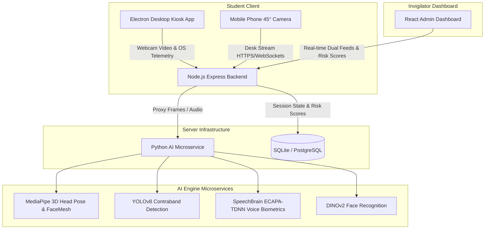

# 🛡️ Proctora: Multi-Modal AI-Powered Remote Exam Proctoring Ecosystem

**Proctora** is a full-stack, multi-camera remote exam proctoring platform featuring native kiosk lockdown, real-time computer vision verification, acoustic anomaly detection, and mobile desk pairing.

---

## 🏗️ System Architecture



---

## 📁 Repository Structure

```
├── ai-engine/                  # Python 3.12 Vision AI (YOLOv8 + MediaPipe + 3D Pose + DINOv2)
│   ├── api.py                  # Flask REST AI bridge (Port 5001)
│   ├── exam_proctor.py         # Multi-modal detection algorithms
│   ├── requirements.txt        # Python dependency manifest
│   └── Dockerfile              # Container definition for cloud deployment
│
├── backend/                    # Node.js Express REST API & Database
│   ├── src/app/server.js       # Main server & AI proxy (Port 4000)
│   ├── src/routes/             # Session, telemetry & secondary-stream endpoints
│   ├── src/models/db.js        # SQLite persistence & schema migrations
│   └── Dockerfile              # Backend container definition
│
├── frontend-student/           # Student Client (React + Vite + Electron Kiosk)
│   ├── electron/main.cjs       # Fullscreen, kiosk lockdown & shortcut interceptor
│   ├── electron/preload.cjs    # Secure IPC bridge
│   └── src/App.jsx             # Dual-camera HUD, question runner & exit controls
│
├── frontend-admin/             # Invigilator Dashboard (React + Vite)
│   └── src/App.jsx             # Live dual-camera grid, risk timeline & drill-down review
│
├── docker-compose.yml          # One-command full-stack containerization
└── package.json                # Monorepo concurrent script runner
```

---

## ⚡ Quick Start (Local Development)

### 1. Prerequisites
- **Node.js**: v18+ or v20+
- **Python**: 3.11 or 3.12
- **npm** or **bun**

### 2. Installation
```bash
# 1. Install all Node.js dependencies across subprojects
npm run install:all

# 2. Setup Python AI environment
cd ai-engine
pip install -r requirements.txt
cd ..
```

### 3. Run the Entire System
```bash
# Runs AI Engine + Backend + Student Desktop Kiosk + Admin Dashboard concurrently
npm run dev
```

- **Student Desktop Kiosk**: Launches in Fullscreen Lockdown
- **Student Mobile Pairing**: `http://<YOUR_LOCAL_IP>:5173/?mode=mobile&session=<SESSION_ID>`
- **Admin Dashboard**: `http://localhost:5174`
- **Backend API**: `http://localhost:4000`
- **Python AI Engine**: `http://localhost:5001`

---

## 🌐 Cloud Hosting & Deployment Guide

### A. Frontend Admin & Student Mobile Client (Vercel)
1. Push repository to GitHub.
2. Import project into [Vercel](https://vercel.com).
3. Set **Root Directory** to `frontend-admin` (for Admin Dashboard) or `frontend-student` (for Web/Mobile student pairing).
4. Build command: `npm run build` | Output directory: `dist`.
5. Add Environment Variable:
   ```env
   VITE_API_BASE=https://your-backend-api.railway.app/api
   ```

### B. Node.js Backend (Railway / Render / Fly.io)
1. Deploy `backend/` folder on **Railway** or **Render Web Service**.
2. Start command: `node src/app/server.js`.
3. Set Environment Variables:
   ```env
   PORT=4000
   NODE_ENV=production
   PYTHON_AI_URL=https://your-ai-engine.render.com
   ```

### C. Python AI Engine (Render / Railway / AWS EC2)
1. Deploy `ai-engine/` as a Docker container or Python Web Service.
2. Dockerfile provided handles OpenCV GL and dependencies automatically.
3. Start command: `python3 api.py`.

### D. Packaging Student Desktop App (macOS & Windows)
```bash
cd frontend-student

# Package for macOS (.dmg / .app)
npm run build && npx electron-builder --mac

# Package for Windows (.exe)
npm run build && npx electron-builder --win
```
Installers will be generated in `frontend-student/dist-electron/`.

---

## 🔒 Security & Proctoring Capabilities

| Feature | Technology | Behavior |
|---|---|---|
| **Kiosk Lockdown** | Electron IPC + OS Hooks | Blocks Alt+Tab, Cmd+W, DevTools, multi-window blur |
| **Desk Cam Pair** | WebRTC / Snapshot Relay | Mobile phone stream verifies desk surface & hands |
| **3D Gaze Tracking** | MediaPipe SolvePnP | Detects looking away ($>22^\circ$) while allowing desk writing |
| **Speaking Detection** | MediaPipe Lips (MAR) | Detects vocalization & whispering |
| **Contraband AI** | YOLOv8n Computer Vision | Real-time detection of smartphones, laptops, books |
| **Voice Biometrics** | SpeechBrain ECAPA-TDNN | Verifies speaker acoustic identity |
| **Face Biometrics** | DINOv2 / DeepFace | Verifies enrolled candidate identity |

---

## 📜 License
MIT License. Created for Proctora Assessment Systems.
